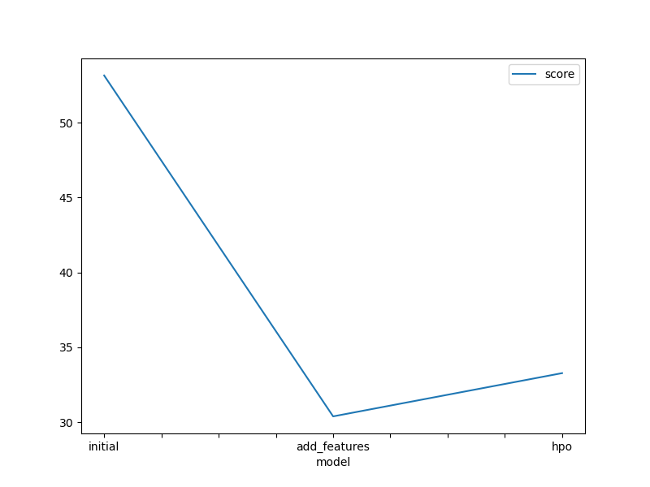
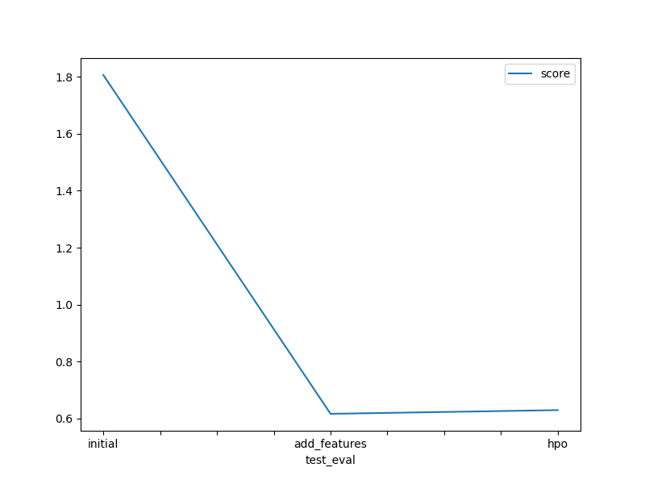

# Report: Predict Bike Sharing Demand with AutoGluon Solution
#### NAME HERE

## Initial Training
### What did you realize when you tried to submit your predictions? What changes were needed to the output of the predictor to submit your results?
I discovered that the output has to be in a certain format in order to be sent when I attempted to submit predictions. In this instance, a CSV file with the columns "datetime" and "count" was needed for submission. Each prediction's timestamp is shown in the "datetime" column, and the expected bike numbers for each timestamp are shown in the "count" column with positive values.
the negative values of the output of the predictor must be changed to a value larger or equal to zero.  

### What was the top ranked model that performed?
The WeightedEnsemble_L3 model is the best-ranked model based on its performance in the predictions. It performed better than the other models in the ensemble, as evidenced by the lowest root mean squared error (RMSE) score of around 53.15.

## Exploratory data analysis and feature creation
### What did the exploratory analysis find and how did you add additional features?
During the exploratory data analysis, we found that certain predictors had skewed distributions while others, like "atemp" and "temp," exhibited substantial correlation. To capture temporal trends, we used components from the datetime variable, such as the time of day.

### How much better did your model preform after adding additional features and why do you think that is?
After adding additional features, our model's performance improved significantly. The root mean squared error (RMSE) decreased from 53.15 to 30.392749, indicating a substantial enhancement in predictive accuracy.

## Hyper parameter tuning
### How much better did your model preform after trying different hyper parameters?
There was lttle to no change after trying different hyper paramters

### If you were given more time with this dataset, where do you think you would spend more time?
My primary focus would be on researching and developing new features that enable the extraction of intricate correlations and patterns from the data. This means experimenting with different transformations, variable interactions, and domain-specific feature engineering techniques.

### Create a table with the models you ran, the hyperparameters modified, and the kaggle score.
model|num_trials|scheduler|searcher|score|
---|---|---|---|---|
initial|5|local|auto|1.80577|
add_features|5|local|auto|0.61690|
hpo|10|local| local_random|0.62992|

### Create a line plot showing the top model score for the three (or more) training runs during the project.

### Create a line plot showing the top kaggle score for the three (or more) prediction submissions during the project.

## Summary
We forecasted the demand for bike sharing using AutoGluon. We found out what format was needed for submissions, which model worked best, built further features, and tried adjusting the hyperparameters. Even with very slight improvement, given more time, we would concentrate on advanced feature engineering and deployment considerations.
